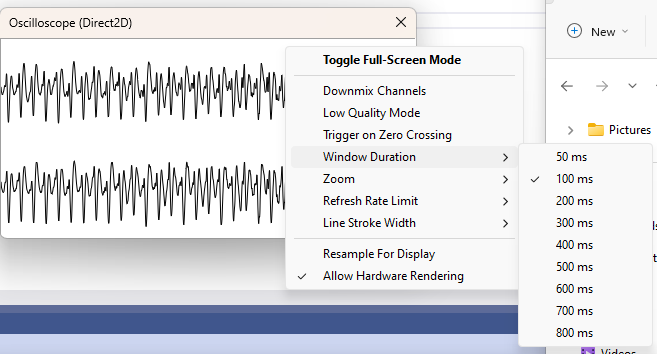

# Oscilloscope visualization with Direct2D rendering for foobar2000

  

## Cover
This is a fork of [Oscilloscope visualization with Direct2D rendering for foobar2000](https://github.com/stengerh/foo_vis_oscilloscope_d2d).  
The intention for this fork is to bring the code base and project files updated to the latest version of Visual Studio.  

## Tested
Visual Studio 2022 17.7.4 Community Edition  
foobar 2000 v2.0 (x86)  
Platform: x64/Win32 on Windows 11  

## TODO
Cleanup build output folders

## Update history
2023-10-12  
Updated with foobar2000 SDK-2023-09-23.7z  
Updated with Visual Studio 2022 code fix and project file for Win32/x64 Debug|Release

